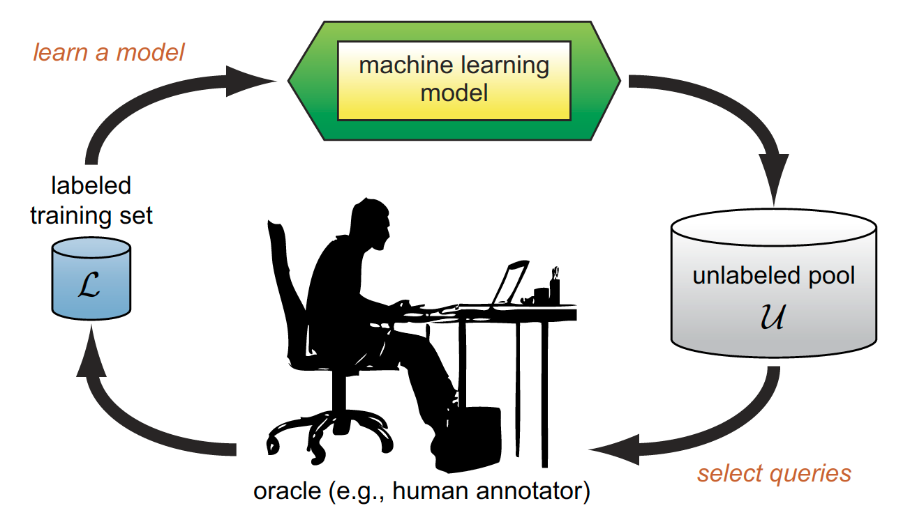
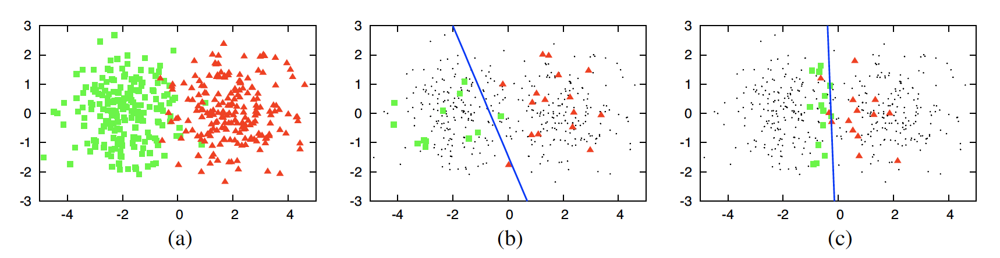
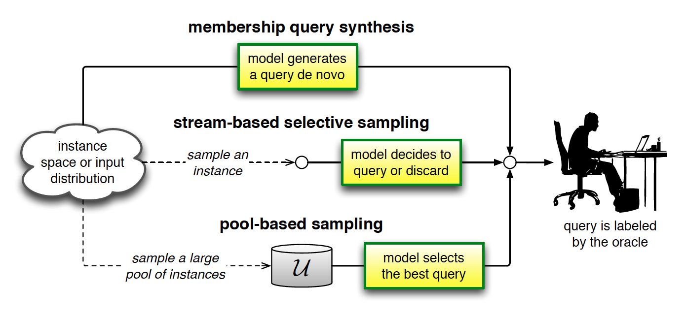
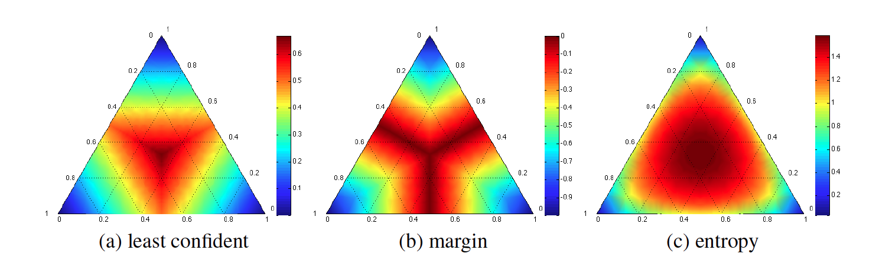
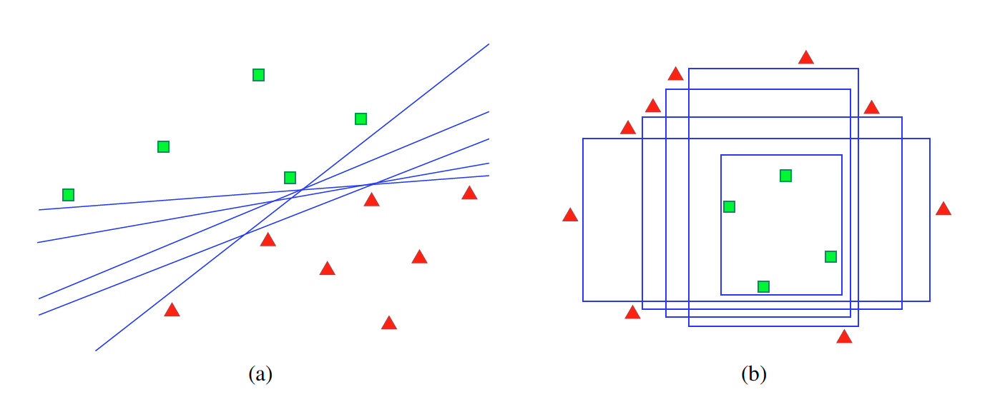
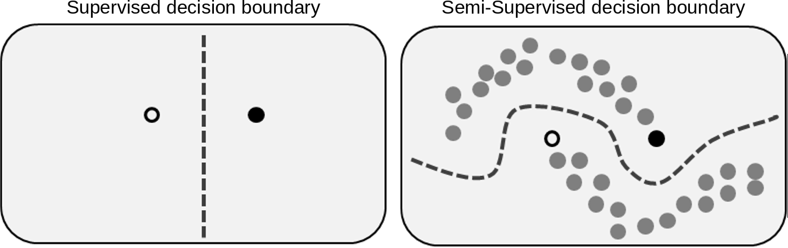

# Workshop Structure

- Intro
  - Motivation
  - Supervised Learning
- Part I
  - Active Learning
- Part II
  - Semi-Supervised Learning
  - Annotation Pipeline
- Q&A

# Reveal.js Basics

- `F` to enter full-screen

  - `ESC` to see the full layout while not in full-screen
  
- `<` `>` to switch between sections

  - When you switch back to a section, it remembers where you left off

- &and; &or; to go back and forth within sections

# Intro: Motivation

## My Background

- Computational social scientist by training (PhD, post-doc @LSE; researcher @UCL)

- Specialisation in predictive modelling & methodology

- Worked as a research scientist on an NLP active learning project conducted by Uppsala University (Sweden)

## My Work

- I'm a senior data scientist at [Attest](https://www.askattest.com)---a customer growth platform

- London start-up aiming to disrupt the market research industry

- We work in cross-functional teams (a la Spotify)

- I am a member of the Audience Quality squad (data quality, fraud detection)

## Problem Statement

- Good: We are a survey company; we generate (store) a lot of data every day

- Bad: The data do not come with labels;

  - Good/bad quality answers (relevance)
  - Open-text validation
  - Speeding/flatlining
  - Impossible/inconsistent demographics
  - etc.
  
## New Frontier: Data Annotation

- Initially, the bottleneck was obtaining data at scale

- Now, unlabelled data is widely accessible:

  - Web scraping
  - Large corpora (text repositories)
  - 'New' types of data (audio, image, video)
  - Industries that generate streaming data (e.g. frequent transactions)
  
## Annotation Trade-Off

- In-house: employees have all-important context; but they don't scale/costly to scale

- Outsourced: e.g. MTurk; scales at a price; but context is mostly lost

- Inter-coder reliability: Adds robustness to labels at the expense of increased costs
  
# Intro: Supervised Learning

## What is ML?

Per Tom Mitchell:

> A computer program is said to learn from experience E with respect to some task T and some performance measure P, if its performance on T, as measured by P, improves with experience E.

- Very CS/SWE oriented definition

## Statistics vs. ML

- What is the difference between traditional statistical models and machine learning algorithms?

  - e.g. Logistic regression vs. Random Forest classifier?

- Not much IMO; I subscribe to Leo Breiman's separation of data vs. algorithmic models

  - i.e. are you trying to explain in-sample variance or to predict out-of-sample?
  
## Model Selection

- Not the technical (i.e. cross-validation) but the more qualitative aspect w.r.t. the data-generating process (DGP)

  - You have a hypothesis X -> y
  
  - And your model is your hypothesis about how -> comes about (e.g. linear, non-linear)
  
## Correlation vs. Causation

- Everyone has heard of the maxim __correlation does not imply causation__

- Causal inference---widely defining here as to include path analysis, SEM, SCM---takes correlation one step further (assuming the given causal structure is appropriate)

- [Ladder of causation](http://bayes.cs.ucla.edu/WHY/why-ch1.pdf)

- CI practitioners such as Judea Pearl argue all of ML is mere curve-fitting

## Bias-Variance Trade-off

## Complexity

- True function complexity vs. size of the training data

  - If the DGP is simple -> inflexible algorithm (high bias, low variance) and a small training set

  - If the DGP is complex -> flexible algorithm (low bias, high variance) and a very large training set

## Dimensionality

- Curse of dimensionality/sparsity

  - Low variance, high bias algorithms can minimise the effect of high (but irrelevant) dimensions
  
  - Also dimensionality reduction techniques ( e.g. PCA, regularisation, feature selection)

## Noise

- Stochastic and deterministic

  - High bias, low variance algorithms can be used to minimise the effect of noise
  
  - Also early stopping criteria; outlier/anomaly detection (risky!)

## Fundamental Problem of Inference

A simplified example from market research---where things can go wrong w.r.t. inference

  - Data -> Sample
  - Sample -> Population
  - Population -> Superpopulation

# Part I: Active Learning

## AL Resources

- Amazing [literature review](http://burrsettles.com/pub/settles.activelearning.pdf) (Settles, 2009)

- AL resources at http://active-learning.net/

- MEAP book by Robert Munro [Human-in-the-Loop Machine Learning](https://www.manning.com/books/human-in-the-loop-machine-learning)

- [modAL](https://github.com/modAL-python/modAL)---highly modular, sk-learn compatible AL framework for Python

- And a lot of great YouTube videos: [Microsoft Research](https://www.youtube.com/watch?v=FE1r7_SQq6Y), [ICML 2019](https://www.youtube.com/watch?v=_Ql5vfOPxZU), [UoM](https://www.youtube.com/watch?v=8Jwp4_WbRio), [Prendki](https://www.youtube.com/watch?v=V33Ut36eUsY)

## Motivation

Consider the conventional (passive) ML pipeline

  - Gather (presumably unlabelled) data
  - Manually label a fraction -> training set
  - Cross-validate hyper-parameters/model selection
  - Predict on test set and report performance metrics
  
## Motivation

- Given the enormous influence of the training set on the accuracy of the final model,

- and the fact that labelling is _costly,_

- is there a more optimal way of obtaining data labels that can scale?

---

<figure>

<figcaption>Source: [modAL documentation](https://modal-python.readthedocs.io/en/latest/content/overview/modAL-in-a-nutshell.html)</figcaption>
</figure>

---

Given limited resources, which data points would you query for their labels?

---

- AL framework posits some data points (instances) are more informative than others

- By learning the true labels for the instances that the model is least confident about (in the figure, the cluster in the centre), the model will then generalise to the remaining instances more easily

- The idea is that we can achieve high model performance by only labelling a fraction of the available data

## AL Framework

<figure>

<figcaption>Source: Settles, 2009</figcaption>
</figure>
---

## AL Cycle

A learner begins with a small number of instances in $\mathcal{L}$ (labelled training set)

1. Request labels for one or more instance (query)
2. Oracle (human annotator) provides labels for the queried instances
3. Learn from the query results (append labelled instances to training set and refit model)
4. Repeat steps 2-4 until a stopping criterion is reached (model performance, empty $\mathcal{U}$, cost)

## AL--Performance Example

<figure>

<figcaption>Source: Settles, 2009</figcaption>
</figure>

---

Toy data generated from two Gaussians centred at (-2,0) and (2,0) with $\sigma=1$

- 200 instances sampled from both classes represented in 2D space (a)
- performance after 30 randomly selected instances are labelled (b, 70%)
- performance after 30 instances selected by AL using uncertainty sampling (c, 90%)

## Sampling Strategies

There are three main sampling scenarios in AL

- Membership query synthesis
- Stream-based selective sampling
- Pool-based sampling

---

<figure>

<figcaption>Source: Settles, 2009</figcaption>
</figure>

## Membership Query Synthesis

- Learner queries instances that it generates _de novo_

  - i.e. the learner generates new samples instead of using existing data points
  
- More useful in certain domains than others

  - Can generate unintelligible/gibberish samples for humans (but evidently not for the machine)

## Stream-based Selective Sampling

- Learner assumes obtaining (not labelling) a data instance is free

- So it can be sampled from the actual distribution

  - Useful if the distribution is non-uniform or unknown

- The learner then decides whether to query or discard the sample (sequential)

## Pool-based Sampling

- Learner assumes there is a small set of labelled data $\mathcal{L}$ and a large pool of unlabelled data $\mathcal{U}$

- Queries are drawn from $\mathcal{U}$, which is assumed to be closed (static)

  - The pool can be dynamic depending on the design

- All instances in $\mathcal{U}$ are ranked based on an informativeness metric, which can then be queried in that order

## Query Strategies

We will consider two main approaches to evaluating the informativeness of an unlabelled instance:

- Uncertainty sampling

  - Least confident
  
  - Margin
  
  - Entropy
  
- Query-by-committee

## Least Confident

- Simplest query strategy: the learner queries the instances about which it is the least certain

- In binary classification, instances whose posterior probability of being positive is closest to 0.5

## Least Confident--Multi-Label

$$x^{*}_{LC}=\underset{x}{\operatorname{argmax}}1-P_{\theta}(\hat{y}|x)$$

where

- $x^{*}_{LC}$ is the most informative instance (query) under strategy $LC$

- $\hat{y}=\text{argmax}_yP_{\theta}(y|x)$ is the class label with the highest posterior probability under model $\theta$

## Least Confident

- In multi-label classification, this can be thought of as the expected 0/1-loss; the degree of belief of the model that it will mislabel $x$.

- However, there is information loss:

  - Only the information about the most probable label is utilised; the rest is discarded
  
## Margin Sampling

$$x^{*}_{M}=\underset{x}{\operatorname{argmin}}P_{\theta}(\hat{y}_{1}|x)-P_{\theta}(\hat{y}_{2}|x)$$

where

- $\hat{y}_{1}$ and $\hat{y}_{2}$ are the first and second most probable class labels under $\theta$

## Margin Sampling

- The inclusion of the posterior of the second most likely class addresses the $LC$ shortcoming

- Intuitively:

  - Large margins denote the model is confident in differentiating classes
  
  - Small margins indicate that the model is ambiguous (and knowing the true label would increase its performance)
  
## Entropy Sampling

$$x^{*}_{H}=\underset{x}{\operatorname{argmax}}-\sum_{i} P_{\theta}(y_{i}|x) \log P_{\theta}(y_{i}|x)$$

where $y_{i}$ ranges over all class labels and $H$ denotes entropy.

## Entropy Sampling

- Margin sampling partially addresses the information loss of least confident

- Entropy generalises margin sampling to all class labels

- For binary-classification, all three approaches are identical

## Uncertainty Sampling--Example

<figure>

<figcaption>Source: Settles, 2009</figcaption>
</figure>

---

- Three classes, each 'occupying' a corner of the triangle

- Red indicates more informative labels; blue denotes that the model is confident

- For all three uncertainty strategies, the centre of the triangle is the most informative (as the posterior probability is uniform in that region)

- Similarly, the least informative regions are the corners

---

- In LC (a), the information slightly diffuses to the class boundaries from centre

- In M (b), the information primarily diffuses from the class boundaries

- In H (c), the information diffuses from the centre

## Query-by-Committee

- Construct a committee $\mathcal{C}=\{\theta^{(1)},\dots,\theta^{(C)}\}$ of models that are trained on labelled data $\mathcal{L}$

- Models represent different hypotheses in a version space

- Models vote on the labels of query candidates

- The most disagreed instance is the most informative query

## Version Spaces

<figure>

<figcaption>Source: Settles, 2009</figcaption>
</figure>

---

- The idea of QbC is to minimise the version space; the hypotheses that are consistent with $\mathcal{L}$

- In the example, linear (a) and axis-parallel box (b) classifiers are shown with their version spaces

- We want to identify the 'best' model within the version space, so the task of AL is to constrain the size of this space as much as possible

## Problem Variants

We will now discuss some generalisations and extensions of AL

- Active Feature Acquisition and Classification

- Active Class Selection

- Active Clustering

## Feature Acquisition

- In some domains, instances can have incomplete (but retrievable) features

  - Medical records, credit card history from another provider, purchase habits etc.
  
- Active feature acquisition operates under the assumption that additional data features can be obtained at a cost

## Feature Acquisition

[Zheng and Padmanabhan (2002)](https://storm.cis.fordham.edu/~gweiss/selected-papers/zheng02.pdf) propose two 'single-pass' approaches

- Impute missing values, then acquire the ones about which the model is least certain

- Alternatively: train models on imputed instances, only acquire feature values for the misclasified instances

## Active Class Selection

- AL assumes instances are free but labelling is costly

- Opposite scenario: learner can query a (known) class label, but obtaining instances is costly

  - e.g. you know the class labels and want to teach the model how to differentiate between them

## Active Clustering

i.e. AL for unsupervised learning

- Counter-intuitive?

- Sample the unlabelled instances in a way that they form self-organised clusters

- The idea is that this can produce clusters with less overlap (noise) than those identified by random sampling

## Practical Considerations

So far, so good. But what are our assumptions?

- Is there always a single oracle?

- Is the oracle always correct?

- Is the cost for labelling constant?

- Is there a determinable endpoint to stop learning?

## Batch-Mode AL

- Traditional AL approaches serially (i.e. one at a time) select instances to be queried

- In parallel learning environments, this is not a desirable characteristic

- Batch-mode allows a learner to query instances in groups

## Batch-Mode AL

- Assume you have 100 instances. You label 10 instances and rank the remaining 90 instances based on their informativeness in one go.

- Do you think this initial ranking would hold if you continue ranking after labelling another 10, 20 etc. instances?

## Batch-Mode AL

- In the case of SVM, several batch-mode AL approaches exist in the literature

- The idea is to introduce a distance metric that measures diversity among instances within a batch

## Noisy Oracles

- How reliable are human annotators?

  - Fatigue, distractions, biases all lower annotation performance

- Traditional AL formulates its cost function purely from a labelling cost standpoint; the obtained label is the _ground truth_

- What if the oracle is noisy?

## Noisy Oracles

- Trade-off: Should the learner query a potentially noisy label of a new instance OR query for repeated labels to de-noise an existing labelled instance that it is not confident?

- What if one oracle is almost always correct and others are noisy?

- Open questions!

## Variable Labelling Costs

- Traditional AL assumes the costs of obtaining a label are uniform

- If known, the varying costs of labelling certain instances can be added to the cost function

- Then, the most informative instance to be labelled is a function of both the labelling cost and its marginal utility

- Costs can be formulaic---e.g. length of the text to be labelled

## Stopping Criteria

- Another cost-related issue is termination---e.g. when to stop learning

- Suggestions include cost/utility functions (learn as long as it is beneficiary) and a pre-determined model performance threshold

- In real life, people tend to stop when their allocated budget runs out

## Further Caveats

- We have challenged some of the assumptions of AL from a cost/benefit perspective (i.e. is it worth it?)

- Another question is: but does it _work?_

- Settles (2009) provides ample empirical evidence from multiple domains showing that AL _does work_

- However, there are caveats

## Path Dependency

- If an AL project is built on a learner and an unlabelled dataset $\mathcal{U}$, it is inherently tied to the hypothesis of its learner

  - i.e. the labelled instances $\mathcal{L}$ is not i.i.d. but a biased distribution
  
- What if we change the model later in the process?

  - No guarantee that $\mathcal{L}$ will be useful
  
  - The larger the distance between model families, higher the risk
  
## Inefficiency

- In some cases, it is shown that AL requires more labelled instances than passive learning even when using the same model class

- If the most appropriate model class and feature set is known _a priori_---using AL is safe

  - Otherwise, random sampling may be more appropriate until the above is established
  
- Heterogeneous model ensembles/feature sets are also advisable in such cases

# Part II: SSL + Data Annotation Pipeline

## Semi-Supervised Learning

Semi-Supervised Learning tackles the annotation problem from the opposite direction

- AL focuses on exploring the unknown from the perspective of a leaner

- While SSL takes advantage of the instances that the model is highly confident about

- [Literature review](http://pages.cs.wisc.edu/~jerryzhu/pub/ssl_survey.pdf) (Zhu, 2008)

## SSL

- SSL is situated between supervised and unsupervised (e.g. clustering) learning paradigms

<figure>

<figcaption>Source: [Wikipedia](https://en.wikipedia.org/wiki/Semi-supervised_learning)</figcaption>
</figure>

## SSL

- Recall the predicted probability figure with red and blue contours in Part I

- SSL posits that, instead of querying the most informative regions (the centre), we can expand the size of $\mathcal{L}$ by appending the instances that the model is fairly certain about

## SSL

- Set an arbitrary threshold; say 95%. Then, every instance in $\mathcal{U}$ that the model predicts with a probability of 95% or higher will be assigned to that class label (as if annotated by a human expert)

- In the figure, this would correspond to the innermost instances at the top left and bottom right being assigned blue and red labels, respectively

## Differences in Label Quality

- However, there is a qualitative difference between the labels obtained by AL and SSL

- Labels annotated by an oracle in AL are thought of as __ground truth__; they are the _true_ labels (oracle quality issues notwithstanding)

- Labels predicted by a model in SSL are thought of as __synthetic__ labels; they are _forecasts_

## Complete Data Annotation Pipeline

As AL and SSL are naturally compatible, it is common to see them employed together in large data annotation projects

- The idea is to attack the problem from two opposite directions using a complimentary framework

- See [Tomanek & Hahn (2009)](https://www.aclweb.org/anthology/P09-1117.pdf) for a Semi-Supervised Active Learning pipeline (SeSAL)

## 1 Cold Start

A general-purpose pipeline combining both AL and SSL assuming cold start---i.e. $\mathcal{L}$ is an empty set; otherwise skip to the next step

- Manually label a small number of instances---can be up to 20-30 data points

- Adjust according to domain/feasibility
  
- Query strategies available on `modAL` will merely give you the first $n$ instances if you start cold
  
  - Make sure the data is shuffled!
  
## 1.5 SSL

Although it may not be viable in the first iteration, when you are repeating the loop:

- Predict class labels (with probabilities) for instances in $\mathcal{U}$

- Consider a threshold that you are comfortable with making a judgement call (>=n% predicted probability)

- Append those instances to $\mathcal{L}$ and delete them from $\mathcal{U}$
    
## 2 Model Fit
  
- Fit a learner on $\mathcal{L}$

  - Pay attention to your qualitative hypothesis and the hypothesis _implied_ by your model/algorithm family selection
  
  - Remember path dependency; are you likely to make drastic changes to the model family?
  
  - If yes, consider an ensemble of learners (query-by-committee)
  
## 3 Sampling Strategy

- How do you obtain data---streaming, fetched in chunks, or do you already have all the data already?

- How heavy is your model? How fast can it predict a single data point?

- Does your model have expectations w.r.t. the data structure?

  - Can it handle one observation or does it require multiple observations?
  
## 4 Query Strategy

- Query an instance from $\mathcal{U}$

  - For binary classification, query strategy is relatively trivial
  
  - For multi-class classification, consider learning goals and expected information loss
  
  - No free lunch!
  
## 5 Human-in-the-loop

- Oracle provides labels to queries -> appended to $\mathcal{L}$

- Pay attention to labelling costs---are they uniform? If not, account for them in your query strategy

## 5 Human-in-the-loop

- Single oracle vs. multiple oracles?

  - How crucial is context for your annotation task?
  
  - Are the annotators equal w.r.t. labelling?
  
  - If the answer is no to both, consider multiple annotators for robustness (funds permitting)

## 6 Rinse and Repeat

- Continue iterating until a stopping criterion is met

  - Usually money!
  
- It is normal that the first iterations are the most volatile

  - Performance might regress, but should pick up soon after
  
  - Otherwise something is not right!
  
## When to Implement SSL

- The SSL stage can be moved around depending on what you want to get out of it

- AL can be used to verify some of the synthetic labels predicted by SSL

- You can experiment with SSL predictions using different thresholds:

  - Which labels would be queried by AL in the next round if you append instances with 99% predicted probability vs. 90%?
  
## Experiment with Ensembles

- There are other ensemble approaches other than Query-by-Committee

- You can use the same model, but have three learners using least confident, margin, and entropy sampling

- You can have one pure AL stream and an AL + SSL stream
  
## Think Ahead
  
- It is possible to be led astray using this approach (i.e. performance degradation over time)

- Create a separate database for keeping track of the labels supplied by AL and SSL
  
- If model performance deteriorates in the future, revert back to an earlier stage and start again

- This also makes sure you know which labels are provided by a human and which ones are synthetically labelled

## Things to Consider

It literally pays to plan ahead:

- What is your budget?

- How much does an individual label cost?

- Are all classes known a priori?

- What is an acceptable model performance to stop learning?

## Outsourcing

In addition to crowdsourced annotation solutions like MTurk, the whole AL + SSL enterprise can be outsourced

- If your company is already using AWS:

  - SageMaker GroundTruth is a frontend for data annotation
  
    - Supports private (employees), public (MTurk), and third-party annotators
    
    - Has a built-in SSL component
    
  - Augmented AI implements AL in a fully managed workflow

# Thanks!